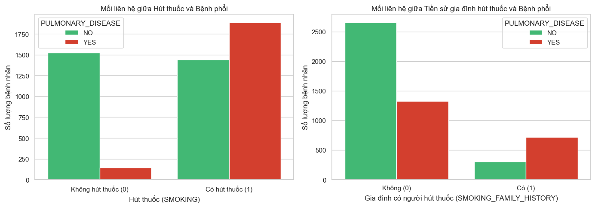
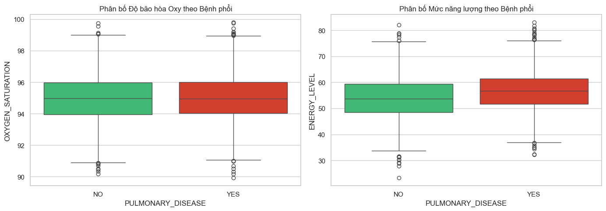
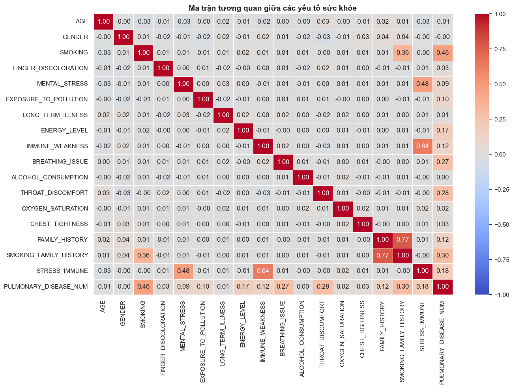
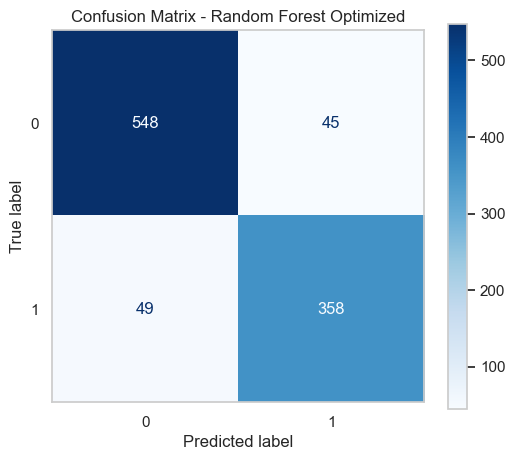

# 🫁 Pulmonary Disease Risk Prediction using Random Forest

[](https://www.python.org/)
[](https://scikit-learn.org/)
[](https://pandas.pydata.org/)

## Project Overview

Pulmonary diseases and lung-related conditions remain important contributors to global health burdens. Early detection through clinical screening and risk assessment can support proactive healthcare and further clinical evaluation.

This project focuses on building and evaluating **Machine Learning models**, centered around the **Random Forest Classifier**, to analyze clinical survey attributes, behavioral factors, and physiological indicators for predicting pulmonary disease risk.

> **Disclaimer:** This project is developed for educational and research purposes. The model is not intended to provide medical diagnosis or replace professional clinical evaluation.

---

## Research Objectives

The main objective of this project is to develop and evaluate a machine learning pipeline capable of predicting pulmonary disease risk based on patient clinical indicators, lifestyle factors, and physiological measurements.

The prediction task is formulated as a binary classification problem:

```text
PULMONARY_DISEASE: YES / NO
```

Key project milestones include:

- **Clinical Data Processing:** Cleaning and preprocessing patient records containing physical metrics, behavioral habits, and physiological markers.
- **Exploratory Data Analysis:** Identifying important risk factors and feature correlations associated with pulmonary disease outcomes.
- **Feature Engineering:** Constructing domain-specific composite features from related behavioral, respiratory, immune, and stress indicators.
- **Comparative Model Evaluation:** Benchmarking **Random Forest**, **Decision Tree**, **Logistic Regression**, **XGBoost**, and **LightGBM** using Accuracy, Precision, Recall, F1-Score, and ROC-AUC.
- **Model Interpretation:** Analyzing feature relationships and model performance to identify important predictive patterns in the dataset.

---

## Dataset Description

The dataset contains **5,000 clinical records** with **18 original attributes** covering demographics, lifestyle, symptoms, and physiological indicators.

### Feature Groups

- **Demographics & Medical History:** `AGE`, `GENDER`, `FAMILY_HISTORY`, `SMOKING_FAMILY_HISTORY`, `LONG_TERM_ILLNESS`
- **Behavioral & Environmental Factors:** `SMOKING`, `ALCOHOL_CONSUMPTION`, `EXPOSURE_TO_POLLUTION`
- **Symptoms & Health Indicators:** `ENERGY_LEVEL`, `OXYGEN_SATURATION`, `BREATHING_ISSUE`, `THROAT_DISCOMFORT`, `CHEST_TIGHTNESS`, `FINGER_DISCOLORATION`, `MENTAL_STRESS`, `IMMUNE_WEAKNESS`, `STRESS_IMMUNE`
- **Target Variable:** `PULMONARY_DISEASE` (`YES` / `NO`)

> **Note:** The target variable is `PULMONARY_DISEASE`. This project should not be interpreted as a clinical diagnosis of lung cancer.

---

## System Architecture

The end-to-end Machine Learning workflow consists of five main stages:

```text
       [ Raw CSV Data ]
              │
              ▼
[ 1. Data Ingestion & Preprocessing ]
              │
              ▼
[ 2. Exploratory Data Analysis ]
              │
              ▼
[ 3. Feature Engineering ]
              │
              ▼
[ 4. Model Training & Benchmarking ]
              │
              ▼
[ 5. Model Evaluation & Insights ]
```

---

## Data Preprocessing & Feature Engineering

Data preparation was performed before model training to create a consistent feature matrix and construct additional domain-specific variables.

### Target Encoding

The categorical target variable was converted into a numerical representation:

```text
YES → 1
NO  → 0
```

The resulting target variable is stored as `PULMONARY_DISEASE_NUM`.

### Domain-Specific Feature Engineering

Three composite features were created by aggregating related indicators:

1. **`SMOKE_RISK`**
   - Combines `SMOKING`, `SMOKING_FAMILY_HISTORY`, and `EXPOSURE_TO_POLLUTION`.
   - Represents combined behavioral and environmental exposure.
   - Scale: `0` to `3`.

2. **`RESP_SYMPTOMS`**
   - Combines `BREATHING_ISSUE`, `THROAT_DISCOMFORT`, and `CHEST_TIGHTNESS`.
   - Represents the accumulation of selected respiratory symptoms.
   - Scale: `0` to `3`.

3. **`IMMUNE_STRESS`**
   - Combines `IMMUNE_WEAKNESS`, `MENTAL_STRESS`, and `STRESS_IMMUNE`.
   - Represents combined immune- and stress-related indicators.
   - Scale: `0` to `3`.

After feature engineering, the input matrix contains **20 features**.

### Sample Engineered Features

| Row Index | `SMOKE_RISK` | `RESP_SYMPTOMS` | `IMMUNE_STRESS` |
| :-------: | :----------: | :-------------: | :-------------: |
|   **0**   |      2       |        2        |        1        |
|   **1**   |      2       |        2        |        1        |
|   **2**   |      1       |        1        |        0        |
|   **3**   |      2       |        2        |        1        |
|   **4**   |      2       |        2        |        1        |

---

## Exploratory Data Analysis

Exploratory Data Analysis was performed to examine the relationships between behavioral factors, symptoms, physiological indicators, and the target variable.

### 1. Smoking & Family History



- **Personal Smoking Habit (`SMOKING`)** shows the strongest direct relationship with the target among the analyzed variables.
- Non-smokers (`0`) contain **1,523 negative cases** and **145 positive cases**.
- Smokers (`1`) account for **1,892 positive cases**.
- A positive family smoking history (`SMOKING_FAMILY_HISTORY = 1`) is associated with a higher positive-case rate, with **715 positive cases out of 1,020 individuals (~70.1%)**.

### 2. Oxygen Saturation & Energy Level



- **Oxygen Saturation (`OXYGEN_SATURATION`)** shows similar median values around **95.0%** across the two target groups.
- Values span approximately **90% to 100%**, with observations at both lower and upper extremes.
- **Energy Level (`ENERGY_LEVEL`)** has a slightly higher median in the positive group (**56.75**) than in the negative group (**53.72**).
- The two groups show substantial overlap in their distributions.

### 3. Feature Correlation Matrix



The Pearson correlation matrix highlights several relationships with the target variable (`PULMONARY_DISEASE_NUM`):

**Primary Positive Associations:**

- **`SMOKING` (`r = 0.46`)** — strongest linear correlation with the target among the analyzed features.
- **`SMOKING_FAMILY_HISTORY` (`r = 0.30`)** — secondary behavioral/family-history indicator.
- **`THROAT_DISCOMFORT` (`r = 0.28`)** and **`BREATHING_ISSUE` (`r = 0.27`)** — respiratory symptoms with positive linear associations.
- **`STRESS_IMMUNE` (`r = 0.18`)** and **`ENERGY_LEVEL` (`r = 0.17`)** — weaker positive associations.

**Collinearity & Interaction Insights:**

- `FAMILY_HISTORY` and `SMOKING_FAMILY_HISTORY` show a relatively strong inter-feature correlation (`r = 0.77`).
- `IMMUNE_WEAKNESS` and `STRESS_IMMUNE` show a correlation of `r = 0.64`.
- `MENTAL_STRESS` and `STRESS_IMMUNE` show a correlation of `r = 0.48`.
- `AGE` (`r = -0.01`) and `GENDER` (`r = -0.00`) show negligible linear correlation with the target.

> Correlation values describe linear association and should not be interpreted as causal relationships.

---

## Dataset Partitioning

The processed dataset (`N = 5,000`) was divided into training and testing subsets using a stratified split.

### Splitting Strategy

- **Training Set:** `80%` / `4,000` samples
- **Testing Set:** `20%` / `1,000` samples
- **Stratified Sampling:** `stratify=y` was used to maintain a representative class distribution across the training and test sets.
- **Reproducibility:** `random_state=42` was used for consistent splitting.

### Class Distribution

| Data Subset      | Total Samples | Negative (`0` / `NO`) | Positive (`1` / `YES`) |
| :--------------- | :-----------: | :-------------------: | :--------------------: |
| **Full Dataset** |     5,000     |    2,963 (59.26%)     |     2,037 (40.74%)     |
| **Training Set** |     4,000     |    2,370 (59.25%)     |     1,630 (40.75%)     |
| **Testing Set**  |     1,000     |     593 (59.30%)      |      407 (40.70%)      |

After feature engineering, both training and testing sets contain **20 input features**.

---

## Machine Learning Models

Five classification algorithms were evaluated:

| Model                   | Description                                                                                   |
| :---------------------- | :-------------------------------------------------------------------------------------------- |
| **Logistic Regression** | Baseline linear classifier evaluating log-odds relationships                                  |
| **Decision Tree**       | Rule-based non-linear tree classifier                                                         |
| **XGBoost**             | Gradient boosting framework for non-linear classification                                     |
| **LightGBM**            | Efficient gradient boosting classifier                                                        |
| **Random Forest**       | Ensemble tree-based bagging classifier designed to reduce variance and improve generalization |

---

## Hyperparameter Optimization

Hyperparameter optimization was applied to selected ensemble models to improve their configuration before final evaluation.

### Random Forest

**GridSearchCV** with **5-fold cross-validation** was used to search across the specified Random Forest hyperparameter combinations.

The selected configuration included:

```text
criterion = entropy
max_depth = 10
min_samples_leaf = 1
min_samples_split = 2
n_estimators = 100
```

### LightGBM

**RandomizedSearchCV** with **5-fold cross-validation** was used to evaluate sampled LightGBM configurations.

This provided a systematic comparison of model configurations before testing on the held-out test set.

---

## Experimental Results & Model Benchmarking

All five models were evaluated on the independent **20% test set (1,000 samples)** using:

- Accuracy
- Precision
- Recall
- F1-Score
- ROC-AUC

### Comparative Performance Summary

| Model                   | Accuracy (%) | Precision (%) | Recall (%) | F1-Score (%) |  ROC-AUC   |
| :---------------------- | :----------: | :-----------: | :--------: | :----------: | :--------: |
| **Decision Tree**       |    80.20%    |    74.82%     |   77.40%   |    76.09%    |   0.7976   |
| **Logistic Regression** |    88.70%    |    84.83%     |   87.96%   |    86.37%    |   0.9260   |
| **XGBoost**             |    90.40%    |    88.40%     |   87.96%   |    88.18%    |   0.9123   |
| **LightGBM**            |  **90.60%**  |  **88.83%**   | **87.96%** |  **88.40%**  |   0.9167   |
| **Random Forest ⭐**    |  **90.60%**  |  **88.83%**   | **87.96%** |  **88.40%**  | **0.9238** |

### Key Empirical Insights

1. **Top Test-Set Performance**
   - **Random Forest and LightGBM** achieved the highest Accuracy (**90.60%**) and F1-Score (**88.40%**) among the evaluated models.

2. **Random Forest Performance**
   - Random Forest achieved **90.60% Accuracy**, **88.83% Precision**, **87.96% Recall**, and **88.40% F1-Score**.
   - It also achieved the highest **ROC-AUC score (0.9238)** among the evaluated models.

3. **Gradient Boosting Benchmarks**
   - XGBoost achieved **90.40% Accuracy** and **88.18% F1-Score**.
   - LightGBM achieved **90.60% Accuracy** and **88.40% F1-Score**, matching Random Forest on these metrics.

4. **Baseline Model Evaluation**
   - Logistic Regression provided a strong linear baseline with **88.70% Accuracy** and **0.9260 ROC-AUC**.
   - Decision Tree achieved the lowest Accuracy among the evaluated models at **80.20%**.

> **Note:** ROC-AUC evaluates ranking/discrimination across classification thresholds, while Accuracy, Precision, Recall, and F1-Score are reported at the selected classification threshold.

---

## Random Forest Confusion Matrix



The Random Forest model correctly classified **906 out of 1,000 test samples**.

|                 | Predicted: NO | Predicted: YES |
| :-------------- | ------------: | -------------: |
| **Actual: NO**  |  **548 (TN)** |    **45 (FP)** |
| **Actual: YES** |   **49 (FN)** |   **358 (TP)** |

### Interpretation

- **True Negatives (TN): 548** — negative cases correctly classified as negative.
- **True Positives (TP): 358** — positive cases correctly classified as positive.
- **False Positives (FP): 45** — negative cases incorrectly classified as positive.
- **False Negatives (FN): 49** — positive cases incorrectly classified as negative.

These values correspond to the reported test-set performance:

- **Accuracy:** 90.60%
- **Precision:** 88.83%
- **Recall:** 87.96%
- **F1-Score:** 88.40%

---

## Repository Structure

```text
Pulmonary-Disease-Risk-Prediction/
│
├── images/
│   ├── correlation_matrix.png
│   ├── smoking_relationship.png
│   ├── oxygen_energy_boxplot.png
│   └── random_forest_confusion_matrix.png
│
├── .gitignore
├── code.ipynb
├── Lung Cancer Dataset.csv
├── README.md
└── requirements.txt
```

---

## Installation & Usage

### 1. Clone the repository

```bash
git clone https://github.com/HoangKaze/Pulmonary-Disease-Risk-Prediction.git
cd Pulmonary-Disease-Risk-Prediction
```

### 2. Install dependencies

```bash
pip install -r requirements.txt
```

### 3. Run the notebook

Open `code.ipynb` using **Jupyter Notebook**, **JupyterLab**, **VS Code**, or **Google Colab**, then run the cells sequentially.

---

## Technologies Used

| Category                    | Technology                                                           |
| :-------------------------- | :------------------------------------------------------------------- |
| **Language**                | Python 3.10+                                                         |
| **Machine Learning Models** | Decision Tree, Logistic Regression, XGBoost, LightGBM, Random Forest |
| **ML Frameworks**           | Scikit-Learn, XGBoost, LightGBM                                      |
| **Visualization**           | Matplotlib, Seaborn                                                  |
| **Scientific Computing**    | NumPy, Pandas                                                        |
| **Notebook**                | Jupyter Notebook                                                     |
| **Development**             | Git, GitHub, VS Code                                                 |

---

## Conclusion & Future Work

### Conclusion

This project developed an end-to-end Machine Learning pipeline to predict pulmonary disease risk using clinical, behavioral, and physiological indicators.

Key takeaways include:

- **Feature Engineering:** Three domain-specific composite features (`SMOKE_RISK`, `RESP_SYMPTOMS`, and `IMMUNE_STRESS`) were introduced to represent cumulative behavioral, respiratory, and immune/stress-related indicators.
- **Model Performance:** Random Forest and LightGBM achieved the highest Accuracy (**90.60%**) and F1-Score (**88.40%**) among the evaluated models.
- **Random Forest Selection:** Random Forest achieved the highest ROC-AUC (**0.9238**) among the evaluated models, while maintaining **88.83% Precision** and **87.96% Recall**.
- **Exploratory Findings:** Smoking-related variables and selected respiratory symptoms showed the strongest linear associations with the target variable in the exploratory analysis.

### Future Work

- **Web Application Deployment:** Deploy the trained Random Forest model as an interactive application or API using **Streamlit** or **Flask** for demonstration and research purposes.
- **Advanced Hyperparameter Tuning:** Explore Bayesian Optimization using `Optuna` to further investigate model configurations.
- **Model Interpretability:** Integrate SHAP values to provide local and global explanations of model predictions.
- **Further Validation:** Evaluate the pipeline on additional datasets to assess how well the model generalizes beyond the current test set.

---

> **Disclaimer:** This project is intended for educational and research purposes only. Model predictions should not be used as a substitute for professional medical diagnosis, treatment, or clinical decision-making.
